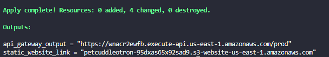

# [Mini-Project] Email Reminder

###  Cenário
Uma empresa solicitou que após certo tempo (tempo definido pelo usuário) um lembrete fosse enviado para o e-mail escolhido pelo usuário para lembra-lo de fazer alguma tarefa importante. Foi exigido que você use aplicações serve-less pois a empresa não gostaria de lidar com servidores.
    
### Arquitetura

Dentro da pasta `iac`temos nossos módulos terraform cada módulo é responsável por subir uma parte da arquitetura dentro da aws.

O módulo `state_machine_module` provisiona o step function que recebe uma requisição do api lambda com um payload indicando o email a receber a notificação e o tempo de espera do lembrete.

O módulo `email_remindar_lambda` ele recebe um e-mail e envia uma notificação para o e-mail selecionado! 

O módulo `api_lambda_module` provisiona um endpoint api gateway post, e um api lambda que vai ser invocado pelo api gateway. Toda vez que uma chamada de api é feita para o api gateway ele recebe a requisição.

O módulo `frontend_module` cria um bucket website stático e sobe os arquivos javascript e html necessários para rodar uma simples aplicação frontend.

### Como Executar

1 - Você precisa configurar suas credências `access_key` e `secret_key` da aws no arquivo `./iac/main.tf` 

2 - Rodar dentro da pasta `iac` o comando

    terraform apply

3 - Se tudo ocorrer bem você verá na saida outputs terraform com o link do `api_gateway_output` e o link com o `static_website_link` como mostra o print abaixo:

4 - Copie o link do `api_gateway_output`, e altere esse link dentro da pasta `./iac/frontend_module/serveless_frontend` no arquivo `serveless.js` na variavel `CHANGE_ENDPOINT`.

5 - Apos isso rode o comando pelo terminal, dentro da pasta `iac` para atualizar somente o módulo de frontend.
    
    terraform apply -target=module.frontend_module
