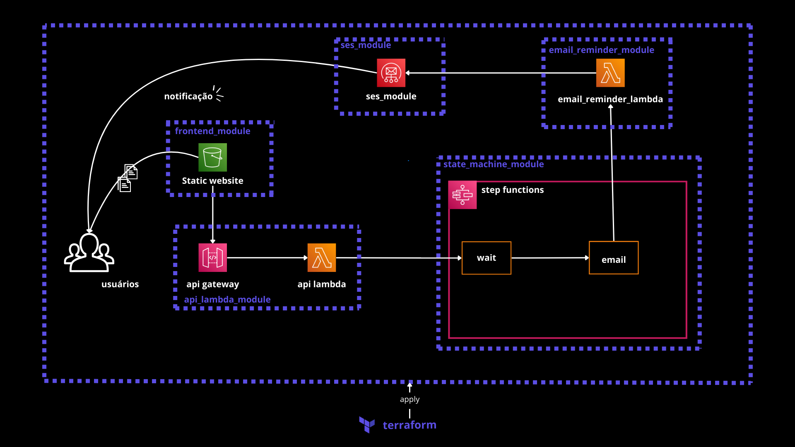
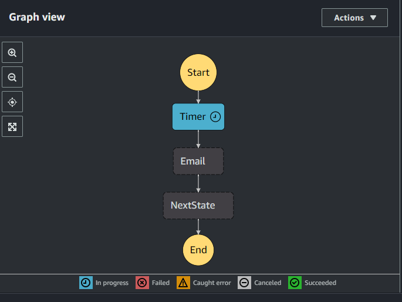

# [Mini-Project] Email Reminder

###  Cenário
Uma empresa solicitou que após certo tempo (tempo definido pelo usuário) um lembrete fosse enviado para o e-mail escolhido pelo usuário para lembra-lo de fazer alguma tarefa importante. Foi exigido que você use aplicações serve-less pois a empresa não gostaria de lidar com servidores. Tambêm foi exigido o uso de terraform caso eles decidam migrar essa arquitetura para uma outra conta futuramente ou queiram mudar algo de maneira rápida.
    
### Arquitetura


Dentro da pasta `iac`temos nossos módulos terraform cada módulo é responsável por subir uma parte da arquitetura dentro da aws.

O módulo `state_machine_module` provisiona o step function que recebe uma requisição do api lambda com um payload indicando o email a receber a notificação e o tempo de espera do lembrete.

O módulo `email_reminder_lambda` ele recebe um e-mail e envia uma notificação para o e-mail selecionado! 

O módulo `api_lambda_module` cria um endpoint API Gateway POST juntamente com uma função lambda associada. Sempre que uma chamada de API é feita para esse endpoint, o API Gateway recebe a requisição e a encaminha para a função lambda correspondente para processamento.

O módulo `frontend_module` cria um bucket website estático e sobe os arquivos javascript e html necessários para rodar uma simples aplicação frontend que se comunica com o endpoint do `api gateway`.

## Configuração Necessária

1 - Você precisa configurar suas credênciais `access_key` e `secret_key` da aws no arquivo `./iac/main.tf` segue exemplo abaixo:

```python
provider "aws" {
    region = "us-east-1"
    access_key = "example"
    secret_key = "example"
}
```

2 - Substitua as variaveis `@EMAIL_SENDER` e `@EMAIL_RECEIVER` localizadas no arquivo `./iac/main.tf` por dois emails que você tenha acesso a visualizar e validar.

## Como Executar
1 - Rodar dentro da pasta `./iac` o comando

    terraform init

2 - Visualize o que será construido com:
    
    terraform plan

3 - Aplique a construção com:

    terraform apply

PRONTO!! APLICAÇÃO PRONTA PARA TESTE!

## Como Testar a Aplicação

1 - Verifique os e-mails da AWS, se você configurou corretamente na etapa de `Configurações Necessárias` você pode ir nos dois e-mails que você colocou, e clicar em um link da AWS que deve ter chegado para vocês. (Verifique no spam) 
  
Print Exemplo:


2 - Agora acesse o link de output do terraform exemplo `petcuddleotron-95dxas65x92sad9.s3-website-us-east-1.amazonaws.com`

3 - Depois de acessar o link você poderá testar a aplicação enviando uma notificação `SOMENTE PARA OS EMAILS QUE VOCÊ CADASTROU COMO SENDER E RECEIVER`! 

Você irá conseguir acompanhar depois que fizer o envio da notificação pelo frontend o estado do wait-time e do e-mail enviado.



